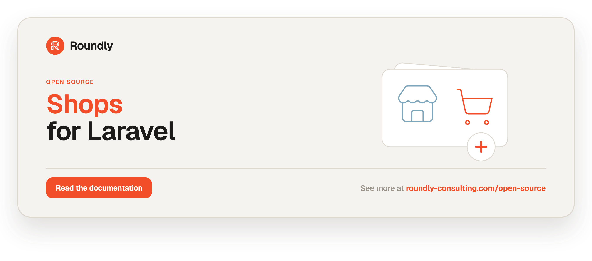

<!-- roundly-hero:start -->
<p align="center">
  <a href="https://roundly-consulting.com/open-source/docs/shops-for-laravel?utm_source=github&utm_medium=readme&utm_campaign=open-source&utm_content=shops-for-laravel">
    
  </a>
</p>
<!-- roundly-hero:end -->

# Shops for Laravel

A production-grade e-commerce foundation for Laravel: products with variants, SKUs and
options, a race-safe inventory ledger with stock reservations, a guarded order state machine,
a persistent cart with one-call order placement, exact net/gross tax pricing on
arbitrary-precision money (orders remember their own currency), native
per-locale translations, and payment & shipping **driver contracts**. Catalog media, product
reviews, spec-sheet attributes, coupons, store credit, and customer address books are powered
by sibling roundly-consulting packages (see **Integrates with**).

## Requirements

- PHP 8.4+ with `ext-bcmath`
- Laravel 12.0 or 13.0

## Integrates with

Shops builds directly on these roundly-consulting packages (installed automatically as
dependencies):

| Package | What it powers in shops |
|---|---|
| [`money-for-laravel`](https://github.com/roundly-consulting/money-for-laravel) | Every amount: `Money`/`Currency`, exact per-line tax (`TaxRate`), discount spreading (`DiscountAllocator`), `TaxSummary`, `AsMoney`/`AsCurrency` casts and `decimal(38,0)` money columns — one Money type shared with coupons and credits |
| [`enums-for-laravel`](https://github.com/roundly-consulting/enums-for-laravel) | Order `Status`, `PriceType` and `StockReason` get `labels()`/`options()`/`validationRule()` and other helpers |
| [`media-library-for-laravel`](https://github.com/roundly-consulting/media-library-for-laravel) | Product featured/gallery images, per-variant images, category banners (public, responsive) |
| [`reviews-for-laravel`](https://github.com/roundly-consulting/reviews-for-laravel) | Product reviews, rating aggregates, verified-purchase gating |
| [`attributes-for-laravel`](https://github.com/roundly-consulting/attributes-for-laravel) | Typed, filterable product spec-sheet attributes |
| [`coupons-for-laravel`](https://github.com/roundly-consulting/coupons-for-laravel) | All coupon/discount logic (percentage in basis points, fixed, free shipping, caps, currency lock, usage limits) |
| [`credits-for-laravel`](https://github.com/roundly-consulting/credits-for-laravel) | "Pay with store credit" tender and store-credit refunds, on a currency-denominated bucket |
| [`addresses-for-laravel`](https://github.com/roundly-consulting/addresses-for-laravel) | Customer address book → order billing/shipping snapshot |
| [`sluggable-for-laravel`](https://github.com/roundly-consulting/sluggable-for-laravel) | Per-locale shop/product/category slugs — unique per shop, DB-enforced, locale-aware route binding, optional SEO slug history |

See `docs/cross-package-integration-plan.md` for the org-wide tier map. Coupon logic now lives
entirely in `coupons-for-laravel`; shops no longer ships its own coupon model.

## Installation

Install the package via Composer:

```bash
composer require roundly-consulting/shops-for-laravel
```

Publish and run the migrations:

```bash
php artisan vendor:publish --tag="shops-migrations"
php artisan migrate
```

Optionally publish the config file:

```bash
php artisan vendor:publish --tag="shops-config"
```

Migrations are **publish-only** — the package never loads them itself, so publishing is a
required step, not an optional one. The fourteen files publish in dependency order (shops →
products → variants → carts → orders), so a single `php artisan migrate` applies them cleanly.
The six provider packages shops builds on (media-library, reviews, attributes, coupons, credits,
addresses) publish their own migrations the same way — publish each before migrating.
Sluggable's only migration (`sluggable-migrations`, the `slug_history` table) is needed just when
you turn on `shops.slugs.history`.

The shops, products and categories migrations create one unique slug index **per supported
locale** — set `sluggable.locales.supported` (e.g. `['en', 'sk']`) before migrating; it defaults
to your `app.locale` + `app.fallback_locale`. See [Slugs & URLs](#slugs--urls).

## Configuration

The published `config/shops.php` documents every key. The most relevant ones:

```php
return [
    // The tenant model every shop-owned record belongs to via "shop_id".
    'shop_model' => env('SHOPS_SHOP_MODEL', \RoundlyConsulting\Shops\Shops\Shop::class),

    'pricing' => [
        'price_type' => env('SHOPS_PRICE_TYPE', 'gross'),
        'default_currency' => env('SHOPS_DEFAULT_CURRENCY', 'EUR'),
    ],

    // Fallback floor (whole percents) used when a shop has no database rate.
    'tax_classes' => [
        'standard' => env('SHOPS_TAX_RATE', 20),
        'reduced' => 10,
        'zero' => 0,
    ],

    'tax' => [
        'resolver' => \RoundlyConsulting\Shops\Support\Tax\DatabaseTaxResolver::class,
    ],

    'orders' => [
        'number_generator' => DefaultNumberGenerator::class,
        'coupon_model' => env('SHOPS_COUPON_MODEL'),
    ],
];
```

| Key | Type | Default | Env | Description |
|---|---|---|---|---|
| `shop_model` | `class-string` | `Shops\Shop::class` | `SHOPS_SHOP_MODEL` | The Eloquent tenant model every owned record points at via its `shop_id` foreign key. Swap in your own model to extend it. |
| `pricing.price_type` | `string` | `gross` | `SHOPS_PRICE_TYPE` | `gross` (tax is extracted from the stored price) or `net` (tax is added on top). |
| `pricing.default_currency` | `string` | `EUR` | `SHOPS_DEFAULT_CURRENCY` | ISO-4217 currency every cart and order uses. |
| `tax_classes` | `array<string,int>` | `standard 20, reduced 10, zero 0` | `SHOPS_TAX_RATE` (standard) | Whole-percent fallback floor used when a shop has no matching database tax rate. |
| `tax.resolver` | `class-string` | `DatabaseTaxResolver::class` | — | Resolves the rate for a `(shop, class, country)` lookup. Defaults to per-shop database rates with the config map as the floor. Bind `ConfigTaxResolver` to use only the config map, or your own `TaxResolver`. |
| `orders.number_generator` | `class-string` | `DefaultNumberGenerator::class` | — | The class used to generate an order number. Must implement `NumberGenerator`. |
| `slugs.history` | `bool` | `false` | `SHOPS_SLUG_HISTORY` | Keep retired shop/product/category slugs and answer old URLs with a 301 to the current one. Needs sluggable's published `slug_history` migration. |
| `orders.coupon_model` | `class-string\|null` | `null` | `SHOPS_COUPON_MODEL` | The Eloquent model backing an order's coupon relation. Must implement the `Coupon` contract. Leave `null` if you do not use coupons. |

## Usage

### Shop facade

The optional `Shop` facade is a discoverable entry point fronting the package's actions. The
underlying `ShopManager` is also resolvable for dependency injection:

```php
use RoundlyConsulting\Shops\Facades\Shop;

$order = Shop::placeOrder($cart, $placeOrderData);
$order = Shop::transition($order, Status::Paid);
$result = Shop::charge($order);
$discount = Shop::discountFor('WELCOME10', Money::ofMinor(1000, 'EUR')); // DiscountResult
```

### Query scopes & route binding

```php
Product::query()->published();          // published_at set and not in the future
Product::query()->unpublished();
Product::query()->forShop($shop);       // filter by a Shop model or a raw shop id
ProductVariant::query()->inStock(2);    // variants with >= 2 available (or untracked)
```

Orders are route-bound by their `number`; products, categories and shops by their per-locale
`slug` (see [Slugs & URLs](#slugs--urls)).

### Shops (tenancy)

A `Shop` is the concrete tenant every owned record belongs to through a plain `shop_id`
foreign key. A single-shop app can ignore it entirely (the column is nullable); a multi-shop
app creates shops and scopes data to them.

```php
use RoundlyConsulting\Shops\Shops\Shop;
use RoundlyConsulting\Shops\Shops\CurrentShop;

$shop = Shop::create(['name' => 'Acme EU', 'currency' => 'EUR']);
$shop->currency();   // Currency (EUR) — the per-shop override, or the configured default when null

// Explicit ownership always wins:
$product = Product::create(['shop_id' => $shop->id, 'name' => 'Sparkling Water']);

// Or bind a current shop and let ownership auto-fill on create:
app(CurrentShop::class)->set($shop);
Product::create(['name' => 'Still Water']);          // shop_id auto-filled
app(CurrentShop::class)->forget();

// Scoped block — restores the previous binding afterwards (even on exception):
app(CurrentShop::class)->run($shop, function () {
    Product::create(['name' => 'Tonic']);            // belongs to $shop
});

Shop::current();                         // ?Shop bound to the current context

Product::query()->forShop($shop)->get();       // scope by model
Product::query()->forShop($shop->id)->get();   // or by id
```

Swap the tenant model by pointing `shops.shop_model` at your own class.

### Per-shop tax rates

Each shop owns many `TaxRate` rows. A rate carries a tax class, an optional ISO-3166-1
alpha-2 country, and a rate in **integer basis points** (1 bp = 0.01%, so `1900` = 19.00%,
`850` = 8.5%). The default `DatabaseTaxResolver` resolves a `(shop, class, country)` lookup
through a fallback chain: an exact country match, then the shop's class default, then the
highest-priority class rate, then the `tax_classes` config floor, then zero.

```php
use RoundlyConsulting\Shops\Shops\TaxRate;
use RoundlyConsulting\Shops\Contracts\TaxResolver;

$shop->taxRates()->create([
    'name' => 'Germany Standard', 'tax_class' => 'standard',
    'country' => 'DE', 'rate' => 1900, 'is_default' => true,   // 19.00%
]);
$shop->taxRates()->create([
    'name' => 'Luxembourg Reduced', 'tax_class' => 'reduced',
    'country' => 'LU', 'rate' => 850,                          // 8.50%
]);

$value = app(TaxResolver::class)->rateFor($shop, 'reduced', 'LU');
$value->percent();        // 8.5
$value->basisPoints;      // 850
$value->grossDivisor();   // 1.085
$value->isZero();         // false

app(TaxResolver::class)->rateFor($shop, 'standard');   // shop's default standard rate
app(TaxResolver::class)->rateFor(null, 'standard');    // config floor (2000 bp = 20%)
```

Order and cart pricing automatically use the owning shop's rate (and, when an order has a
shipping address, its country), so tax differs correctly per shop.

### Products and categories

Products and categories belong to an optional `shop` tenant (so the same tables serve a
single shop or many), generate a URL slug from their `name`, and use the slug as the route
key.

```php
use RoundlyConsulting\Shops\Products\Product;
use RoundlyConsulting\Shops\Products\Category;
use RoundlyConsulting\Money\Money;

$category = Category::create(['name' => 'Beverages']);
// $category->slug === 'beverages'

$product = Product::create(['name' => 'Sparkling Water']);
$product->categories()->attach($category);

$product->price; // RoundlyConsulting\Money\Money — proxied from the default variant
```

`name`, `slug`, and `description` on products and categories are **translatable**, stored as
native per-locale JSON. Reads transparently return the current locale's value (falling back to
`shops.locales.fallback`); a plain-string write is stored under the current locale, so simple
single-language stores need no extra work:

```php
$product->setTranslation('name', 'en', 'Sparkling Water');
$product->setTranslation('name', 'sk', 'Perlivá voda');
$product->save();

app()->setLocale('sk');
$product->name;                       // "Perlivá voda"
$product->getTranslation('name', 'en'); // "Sparkling Water"
$product->getTranslations('name');      // ['en' => '...', 'sk' => '...']
```

Slugs are generated per locale from the name's translations.

### Slugs & URLs

Shop, product and category slugs are powered by
[`sluggable-for-laravel`](https://github.com/roundly-consulting/sluggable-for-laravel). Each model
stores one slug per locale in its `slug` column and uses it as the route key:

| Model | Unique | Example |
|---|---|---|
| `Shop` | across all shops, per locale | `acme`, `acme-2` |
| `Product` | within its shop, per locale | two shops may both sell `chair`; a second "Chair" in one shop is `chair-2` |
| `Category` | within its shop, per locale | same as products |

- **Generated per locale** from `name`: `['en' => 'Chair', 'sk' => 'Stolička']` →
  `['en' => 'chair', 'sk' => 'stolicka']`.
- **Enforced by the database** — the migrations add a unique index per supported locale (scoped
  by `shop_id` on products and categories), so even a race or a raw insert cannot duplicate one.
  Soft-deleted rows keep their slug reserved, so a restore never collides.
- **Manual slugs** are normalised and made unique (`'Custom Slug!'` → `custom-slug`); a locale
  added later is filled in on the next save; an empty name gets a random slug.
- **Route binding** matches the request locale, then `shops.locales.fallback`, then any locale —
  and works on every database engine, including tenant-scoped routes:

```php
Route::get('/shops/{shop}/products/{product}', ShowProduct::class)->scopeBindings();
// /shops/acme/products/chair — another shop's "chair" is a 404
```

Every sluggable reader and scope is available on the three models:

```php
$product->currentSlug();              // "stolicka" under sk
$product->slugFor('en');              // "chair"
$product->slugMap();                  // ['en' => 'chair', 'sk' => 'stolicka']
Product::query()->forShop($shop)->whereSlug('chair')->first();
```

The default variant's SKU derives from the **fallback-locale** slug (`CHAIR-DEFAULT`), so it is
the same whatever locale the creating request ran under.

**Slug history (opt-in).** Set `SHOPS_SLUG_HISTORY=true` and publish sluggable's migration
(`php artisan vendor:publish --tag="sluggable-migrations"`) — renamed products keep answering
their old URL with a 301 to the new one.

**Upgrading an existing database.** Earlier builds did not enforce unique slugs, and a database
that already ran the shops migrations has no slug indexes yet. Per model (`Shops\Shop`,
`Products\Product`, `Products\Category`): find duplicates, preview and apply the rewrite, then add
the indexes:

```bash
php artisan sluggable:duplicates "RoundlyConsulting\Shops\Products\Product"
php artisan sluggable:regenerate "RoundlyConsulting\Shops\Products\Product" --mode=all --dry-run
php artisan sluggable:regenerate "RoundlyConsulting\Shops\Products\Product" --mode=all
php artisan sluggable:indexes "RoundlyConsulting\Shops\Products\Product"
```

Adding a locale later works the same way: `sluggable:regenerate … --locale=de` backfills it and
`sluggable:indexes` adds its index.

### Variants, SKUs and options

Every sellable unit is a `ProductVariant` with its own `sku`, `price`, `currency`, tax class,
and stock. A product created without explicit variants automatically gets **one default
variant** (a zero price in its shop's currency), so simple single-SKU products stay a
one-liner; `$product->price` proxies the default variant's price.

```php
use RoundlyConsulting\Money\Money;

// Add explicit variants:
// The price cast writes the `currency` column from the Money itself.
$small = $product->variants()->create([
    'sku' => 'WATER-0.5L', 'price' => Money::ofMinor(199, 'EUR'), 'stock' => 50,
]);
$large = $product->variants()->create([
    'sku' => 'WATER-1L', 'price' => Money::ofMinor(299, 'EUR'), 'stock' => 30,
]);

// Re-pricing in another currency: set `currency` BEFORE `price` — the cast refuses to
// silently re-denominate a column that already holds another code (CurrencyMismatch).
$small->update(['currency' => 'USD', 'price' => Money::ofMinor(219, 'USD')]);

$product->defaultVariant;       // lowest-position variant
$small->inStock(10);            // bool — respects track_stock and reserved quantity
$small->availableStock();       // stock - reserved
```

Options (e.g. Size, Colour) compose variants. Resolve a variant from a set of option values:

```php
use RoundlyConsulting\Shops\Products\ProductOption;

$size = ProductOption::create(['product_id' => $product->id, 'name' => 'Size']);
$small = $size->values()->create(['value' => 'S']);
$large = $size->values()->create(['value' => 'L']);

$variant->optionValues()->attach([$small->id]);

$product->variantFor([$small->id]); // ?ProductVariant
```

### Inventory & stock

Stock is an auditable ledger: every change is a `StockAdjustment` row, and the variant caches
`stock` (on hand) and `reserved` (held for pending orders). All writes go through
`AdjustStockAction`, which row-locks the variant inside a transaction to avoid oversell:

```php
use RoundlyConsulting\Shops\Inventory\Actions\AdjustStockAction;
use RoundlyConsulting\Shops\Inventory\Enums\StockReason;

app(AdjustStockAction::class)->execute($variant, 100, StockReason::Received);   // +100 on hand
app(AdjustStockAction::class)->execute($variant, -1, StockReason::Sold, $order); // sell one
```

Selling below available stock on a `track_stock` variant throws `InsufficientStockException`;
variants with `track_stock = false` (digital/unlimited goods) never throw. Every adjustment
fires `StockAdjusted`, and crossing `shops.inventory.low_stock_threshold` fires `StockRanLow`.

Orders manage reservations automatically: `ReserveStockAction` holds each line's quantity when
an order is placed, canceling an order **releases** the hold, and fulfilling an order
**converts** the reservation into a sale (decrementing on-hand stock). An oversell during
reservation rolls back the whole order and holds nothing.

### Money

Every amount in shops is a [money-for-laravel](https://github.com/roundly-consulting/money-for-laravel)
`RoundlyConsulting\Money\Money`: minor units as an exact integer string in a registered
currency with its real exponent (JPY 0, EUR 2, BHD 3). Prices are `decimal(38,0)` columns
cast with `AsMoney::currencyColumn('currency')`; carts and orders cast `currency` to a
`Currency`. Shops ships no money primitive of its own — coupons and credits speak the same
type, so nothing is converted between packages.

```php
use RoundlyConsulting\Money\Money;

$price = Money::ofMinor(1000, 'EUR');       // 10.00 EUR
$total = Money::sum([$price, Money::ofMinor(500, 'EUR')]); // 15.00 EUR
$price->minor();                            // "1000" (string — exact past int64)
$price->currency()->code;                   // "EUR"
(string) $price;                            // "10.00 EUR"
```

Mixing currencies throws money's `CurrencyMismatch` — including adding a variant to a cart or
order in another currency.

### Orders and pricing

### Cart & placing an order

A `Cart` is a persistent basket with an optional polymorphic `owner` (a user) or a guest
`token` for anonymous checkout, plus its currency. Add variants to it (a variant priced in
another currency throws `CurrencyMismatch`) and read its price through the same engine orders
use:

```php
use RoundlyConsulting\Shops\Cart\Cart;

$cart = Cart::create(['currency' => 'EUR']);
$cart->add($variant, quantity: 2);   // snapshots name/sku/price; same variant increments

$cart->subtotal();   // Money
$cart->price();      // Price DTO (pass a coupon to discount it)
```

`PlaceOrderAction` turns a cart into an order in one transaction — snapshotting each line,
reserving stock, linking a coupon by code, storing the billing/shipping address, generating the
number, firing `OrderPlaced`, and clearing the cart. An oversell rolls everything back and
leaves the cart untouched:

```php
use RoundlyConsulting\Shops\Orders\Actions\PlaceOrderAction;
use RoundlyConsulting\Shops\Orders\DataTransferObjects\Address;
use RoundlyConsulting\Shops\Orders\DataTransferObjects\PlaceOrderData;

$order = app(PlaceOrderAction::class)->execute($cart, new PlaceOrderData(
    billing: new Address('Ada Lovelace', '1 Analytical Way', 'London', 'EC1', 'GB'),
    couponCode: 'WELCOME10',
));
```

Billing and shipping addresses are stored as JSON and cast to an immutable `Address` DTO.

### Orders and pricing

An order has many `items`, an optional `coupon`, an automatically generated `number`, and its
own **`currency`** — snapshotted when it is created (from the cart at place-order, else its
shop's, else `SHOPS_DEFAULT_CURRENCY`), so changing the configured default never
re-denominates historical orders. Its `price` accessor returns a `Price` DTO that computes discount, shipping, tax, and the final
total from the order's items and the discount **snapshotted when the order was placed**
(`discount`, `free_shipping`, `coupon_code`) — a coupon that later expires, is revoked or runs
out of uses never re-prices a placed order. The same holds for tax: `AddOrderItemAction`
snapshots the rate each line's tax class resolves to (`order_items.tax_rate` in basis points +
`tax_label`) and the order keeps the `price_type` it was created under, so editing a shop's tax
rates, changing the shipping address or flipping `shops.pricing.price_type` later never changes
what a placed order costs. An item written without a snapshot (`tax_rate` null) is taxed at the
live rate.

```php
use RoundlyConsulting\Shops\Orders\Order;
use RoundlyConsulting\Shops\Orders\Item;
use RoundlyConsulting\Money\Money;

$order = Order::create([]);              // number auto-generated, e.g. "24000001"

Item::create([
    'order_id' => $order->id,
    'name' => 'Sparkling Water',
    'quantity' => 2,
    'price' => Money::ofMinor(199, 'EUR'), // must match the order's currency
]);

$price = $order->price;                  // RoundlyConsulting\Shops\Orders\DataTransferObjects\Price

$price->getSubtotal();           // sum of line totals (quantity-aware), before discount
$price->getPriceAfterDiscount(); // after the placed discount (if any)
$price->getNetPrice();           // tax-exclusive value of the goods
$price->getTaxPrice();           // tax across the goods (after discount)
$price->getDiscountValue();      // amount saved by the placed discount
$price->getFinalPrice();         // amount the customer pays (goods + shipping, tax-correct)
$price->taxSummary();            // money TaxSummary: net / tax / gross per rate (invoice VAT table)
```

Pricing is **quantity-aware** (a 2× line is billed twice) and **tax-correct** for both
tax-inclusive and tax-exclusive catalogs. Set `shops.pricing.price_type` to `gross`
(default — tax is *extracted* from the price) or `net` (tax is *added on top*). Tax rates
are resolved per line by the owning shop's database rates (with country awareness), falling
back to the `tax_classes` config map; host applications can supply their own jurisdiction
logic by binding a custom `TaxResolver`.

Tax is **exact**: an order-level discount is first spread over the lines in proportion to
their totals (money's `DiscountAllocator` — the shares sum to the discount), then each line is
taxed once on its discounted amount with money's `TaxRate` (gross: `gross × 100 / (100 +
rate)`; net: `net × rate`), rounding half away from zero. No floats, so a gross catalog always
satisfies `net + tax = price after discount`, and large or exotic-exponent amounts are taxed
exactly.

### Order status & lifecycle

Orders move through a guarded state machine. The statuses are `New`, `InProgress`, `Paid`,
`Fulfilled`, `Canceled`, and `Refunded`, with these allowed transitions:

```
New        → InProgress | Canceled
InProgress → Paid | Canceled
Paid       → Fulfilled | Refunded
Fulfilled  → Refunded
Canceled, Refunded   (terminal)
```

Transition with the helper methods on the order; each one validates the move, stamps the
matching timestamp column (`in_progress_at`, `paid_at`, `fulfilled_at`, `canceled_at`,
`refunded_at`), persists, and fires events:

```php
use RoundlyConsulting\Shops\Orders\Enums\Status;

$order->markInProgress();   // New → InProgress
$order->markPaid();         // InProgress → Paid, stamps paid_at, fires OrderPaid
$order->markFulfilled();    // Paid → Fulfilled, fires OrderFulfilled
$order->cancel();           // → Canceled, fires OrderCanceled
$order->refund();           // Paid|Fulfilled → Refunded, fires OrderRefunded

// Or transition explicitly:
$order->transitionTo(Status::Paid);

// Reads:
$order->status->is(Status::Paid);                       // bool
$order->status->isIn([Status::Paid, Status::Fulfilled]); // bool
$order->status->canTransitionTo(Status::Refunded);       // bool
$order->status->isTerminal();                            // bool
```

An illegal transition (e.g. refunding a `New` order) throws
`RoundlyConsulting\Shops\Orders\Exceptions\IllegalStatusTransitionException` and changes
nothing. Every transition fires `OrderStatusChanged` (carrying `from`/`to`) plus a
status-specific event (`OrderPaid`, `OrderFulfilled`, `OrderCanceled`, `OrderRefunded`)
your application can listen to.

### Order numbers

By default order numbers are `<two-digit year><6-digit sequence>` (e.g. `24000001`),
sequenced per year and counting soft-deleted orders. A number is assigned once, when the order
is first inserted (unless you set one) — never when orders are loaded. `orders.number` is
unique across all orders (orders route-bind by it): the default generator skips numbers that
are already taken, and when two checkouts race to the same generated number the second insert
is refused by the index and simply asks the generator again (up to 5 times, in a savepoint). An
explicitly set number is never replaced — a duplicate throws. Provide your own strategy by
implementing `NumberGenerator` and pointing `shops.orders.number_generator` at it:

```php
use RoundlyConsulting\Shops\Orders\NumberGenerators\NumberGenerator;
use RoundlyConsulting\Shops\Orders\Order;

final class UuidNumberGenerator implements NumberGenerator
{
    public function generate(Order $order): string
    {
        return (string) \Illuminate\Support\Str::uuid();
    }
}
```

### Product media

Products, variants, and categories carry images via `media-library-for-laravel`. Catalog media
is **public** by default (CDN/SEO friendly) and generates responsive variants from the width
ladder in `shops.media`.

```php
use Illuminate\Http\UploadedFile;

$product->addMedia($file)->toMediaBucket($product->featuredBucket()); // single featured image
$product->addMedia($file)->toMediaBucket($product->galleryBucket());  // multi-image gallery

$product->featuredImageUrl('detail'); // a named responsive variant
$product->galleryUrls();              // list<string>
$product->seoImageUrl();              // featured, falling back to the first gallery image

$variant->addMedia($file)->toMediaBucket($variant->variantGalleryBucket());
$variant->variantImageUrl();

$category->addMedia($file)->toMediaBucket($category->bannerBucket());
$category->bannerUrl();
```

Bucket names, disk, visibility, responsive widths, and max file size are configured under
`shops.media`.

### Reviews

Products are reviewable via `reviews-for-laravel`, with rating aggregates:

```php
$product->addReview($user)->rating(5)->title('Great')->content('Love it')->approved()->create();

$product->approvedReviewsCount(); // int
$product->averageRating();        // ?float (approved reviews only)
$product->ratingDistribution();   // [5 => 12, 4 => 3, ...]
$product->ratingSummary();        // RatingSummary{average, count, distribution}
```

**Verified purchase.** `$product->review($user)` pre-flags the review as a verified purchase
using the bound `VerifiedPurchaseResolver`. The default `NullVerifiedPurchaseResolver` never
verifies; point `shops.reviews.verified_purchase_resolver` at
`DatabaseVerifiedPurchaseResolver` to verify buyers with a **paid and fulfilled** order
containing the product (requires the order to carry a customer — see **Order customer**).

### Spec sheet (attributes)

Typed, validated, filterable product attributes via `attributes-for-laravel` — the descriptive
spec sheet that complements variant *options* (which define SKUs). Define the schema under
`shops.attributes.definitions`:

```php
// config/shops.php
'attributes' => ['definitions' => [
    'material' => ['type' => 'string'],
    'weight'   => ['type' => 'integer', 'rules' => ['min:0']],
]],
```

```php
$product->attachAttribute('material', 'wool');
$product->attachAttribute('weight', 500);
$product->attr('material')->string(); // 'wool'
$product->attr('weight')->int();      // 500

Product::query()->whereAttribute('material', 'wool')->get();
Product::query()->whereAttributeBetween('weight', 100, 500)->get();
Product::query()->orderByAttribute('weight', 'desc')->get();
```

With `attributes.strict` enabled, attaching an undefined attribute throws
`UnknownAttributeException` and an ill-typed value throws `InvalidAttributeValueException`.

### Coupons & discounts

Coupons are powered entirely by `coupons-for-laravel`. Create coupons with that package, then
reference them by **code** — shops resolves the discount through the bound `DiscountResolver`
and records the redemption at place-order:

```php
use RoundlyConsulting\Coupons\Facades\Coupons;
use RoundlyConsulting\Coupons\Enums\DiscountType;
use RoundlyConsulting\Shops\Facades\Shop;
use RoundlyConsulting\Money\Money;

$coupon = Coupons::generate(DiscountType::Percentage, 1000, 'WELCOME10'); // basis points: 10 %
$coupon->activate()->save();

// Preview a discount (no redemption):
$result = Shop::discountFor('WELCOME10', Money::ofMinor(1000, 'EUR'));
$result->discount; // 1.00 EUR off
$result->source;   // the coupon as a money Discount, to compose in a DiscountStack

// Price a cart with a code (defaults to the cart's stored coupon_code):
$cart->price('WELCOME10')->getFinalPrice();
```

At place-order the coupon is linked to the order and redeemed once for the buyer, and the
discount it grants is **snapshotted** onto the order (`discount` in the order currency,
`free_shipping`, `coupon_code`). The order's price reads that snapshot, so expiring, revoking or
exhausting the coupon afterwards — including the single use this order consumed — never changes
what the order costs (free-shipping coupons zero the shipping line). Swap the coupon model or
resolver via `shops.discounts`.

### Pay with store credit

With `credits-for-laravel`, buyers can pay all or part of an order from a store-credit bucket
**denominated in the order's currency**. Map the bucket in `config/credits.php`:

```php
'currencies' => ['store_credit' => 'EUR'], // your shop currency; one bucket per currency
```

Enable `shops.payment.allow_store_credit` (env `SHOPS_ALLOW_STORE_CREDIT`); `ChargeOrderAction`
then debits available credit before charging the gateway for the remainder
(`$order->gatewayAmount()`) — an order credit covers in full is marked paid without a gateway
charge. The bucket is
`shops.payment.store_credit_bucket`, and refunds can be returned as store credit via
`shops.payment.refund_to_store_credit`.

```php
use RoundlyConsulting\Shops\Payments\StoreCreditTender;

$remainder = app(StoreCreditTender::class)->apply($order, $customer); // Money still owed
$remainder = app(StoreCreditTender::class)->apply($order, $customer, Money::ofMinor(500, 'EUR')); // cap the debit

$order->store_credit_applied; // ?Money, in the order currency
```

An undenominated bucket throws `StoreCreditBucketNotDenominated` and a bucket in another
currency `StoreCreditCurrencyMismatch` (both before any credit moves). The refund listener
skips such a bucket with a `Log::warning()` instead — the refund has already happened.

### Customer address book

With `addresses-for-laravel`, build an order's billing/shipping snapshot from a customer's saved
addresses. Add `HasAddresses` to your customer model, then:

```php
use RoundlyConsulting\Shops\Orders\DataTransferObjects\PlaceOrderData;

$order = Shop::placeOrder($cart, PlaceOrderData::fromAddressBook($customer));
```

Shipping is taken from the customer's primary shipping address and billing from their primary
billing address; when no billing address exists, the shipping address is reused (toggle with
`shops.addresses.billing_same_as_shipping`). The order keeps snapshotting addresses — there is
no foreign key to the address book.

### Order customer

`Order` carries an optional polymorphic `customer` (the buyer), copied from the cart's owner at
place-order. It powers the address book, store credit, and verified-purchase reviews. It is
nullable, so guest orders are fully supported.

### Payment & shipping drivers

The package defines payment and shipping as **driver contracts** and ships no vendor SDK. Bind
your own implementation via config; the defaults work zero-config (a null gateway that always
succeeds, and free shipping):

```php
use RoundlyConsulting\Shops\Contracts\PaymentGateway;
use RoundlyConsulting\Shops\Orders\Order;
use RoundlyConsulting\Shops\Payments\PaymentResult;
use RoundlyConsulting\Money\Money;

final class StripeGateway implements PaymentGateway
{
    // Charge $order->gatewayAmount(): the total minus any store credit already applied.
    public function charge(Order $order): PaymentResult { /* … */ }
    public function refund(Order $order, Money $amount): PaymentResult { /* … */ }
}
```

Register it in `config/shops.php` (`payment.gateway` / `shipping.method`). Charge an order
through the bound gateway with `ChargeOrderAction` — on success it transitions the order to
`Paid`:

```php
use RoundlyConsulting\Shops\Orders\Actions\ChargeOrderAction;
use RoundlyConsulting\Shops\Orders\Actions\QuoteShippingAction;

$result = app(ChargeOrderAction::class)->execute($order); // PaymentResult
$quote  = app(QuoteShippingAction::class)->execute($order, $destinationAddress); // Money
```

A failed charge leaves the order's status unchanged. A zero balance (store credit covered the
order, or it is free) skips the gateway and succeeds with a zero amount.

Refunds are **host-driven**: the package never calls the gateway's `refund()`. Refund through
your gateway (at most `$order->gatewayAmount()`), then transition the order:

```php
$result = app(PaymentGateway::class)->refund($order, $order->gatewayAmount());

if ($result->successful) {
    $order->refund(); // → Refunded, fires OrderRefunded
}
```

The gateway only took `gatewayAmount()`: return any store-credit share yourself
(`$customer->modifyCreditsMoney($order->store_credit_applied, bucket: …)`). With
`shops.payment.refund_to_store_credit` on, **skip the gateway refund** — `$order->refund()` alone
credits the whole order total back as store credit, and doing both refunds the buyer twice.

## Upgrading

Shops is pre-1.0 and unreleased, so its migrations were edited in place — re-run them on a
fresh database. Moving onto money-for-laravel changed:

- Every `Money` is `RoundlyConsulting\Money\Money` (`ofMinor()`, string `minor()`); the old
  `Support\Money` classes, `MoneyCast`, `MoneyBridge` and the three money exceptions are gone.
- Prices and `store_credit_applied` are `decimal(38,0)`; `orders.currency` is new.
- `orders` gained the discount snapshot (`discount`, `free_shipping`, `coupon_code`); an order's
  price no longer re-resolves its coupon, and a bare `coupon_id` link discounts nothing.
- Tax is allocated per line after the discount (may differ by ≤ 1 minor unit per line from the
  previous total-level ratio).
- `orders.price_type` and `order_items.tax_rate` / `tax_label` are new: an order keeps the price
  type and the per-line tax rates it was placed with.
- `orders.number` is unique on its own (was `(number, shop_id)`).
- Store credit needs a denominated bucket: add `'currencies' => ['store_credit' => 'EUR']` to
  `config/credits.php`.
- Coupon percentages are basis points (`1000` = 10 %) and fixed coupons are currency-locked
  (coupons-for-laravel).

## Testing

```bash
composer test
```

## Changelog

Please see [CHANGELOG](CHANGELOG.md) for more information on what has changed recently.

## License

The MIT License (MIT). Please see [License File](LICENSE.md) for more information.
